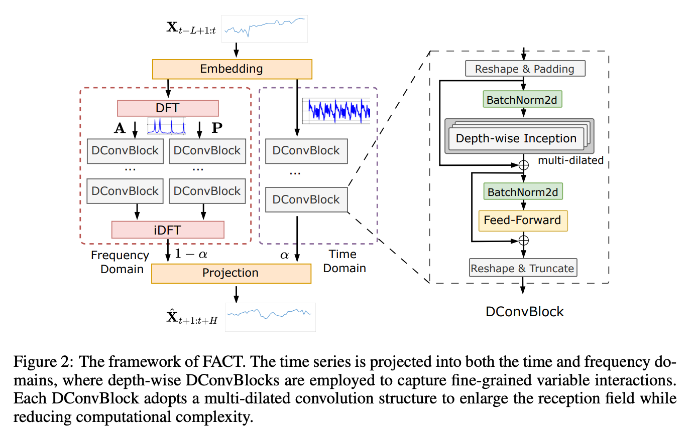
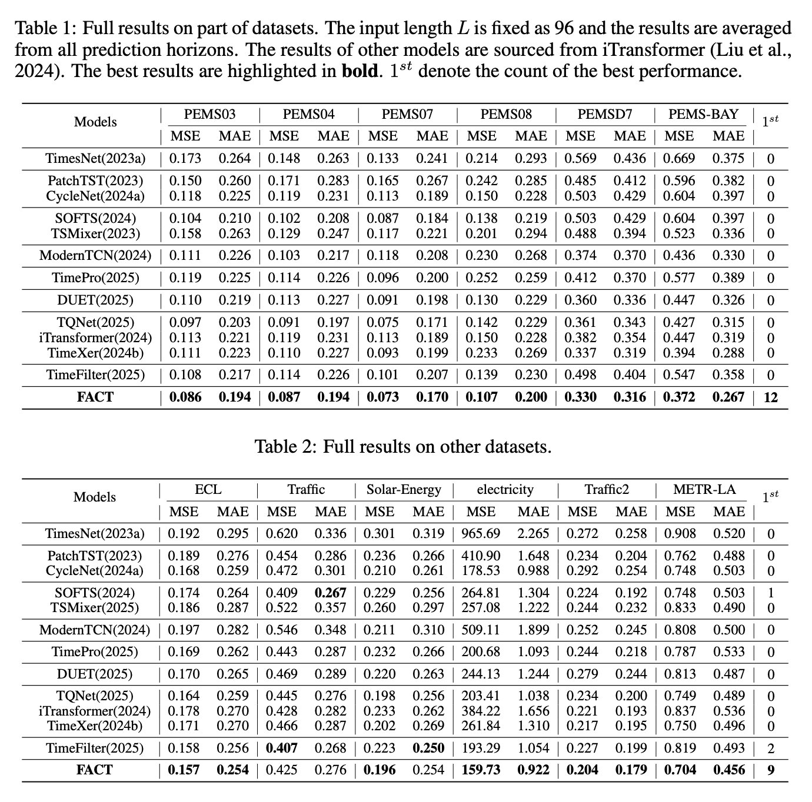
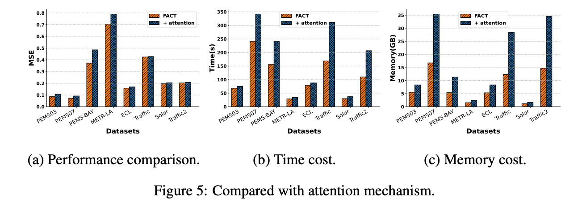
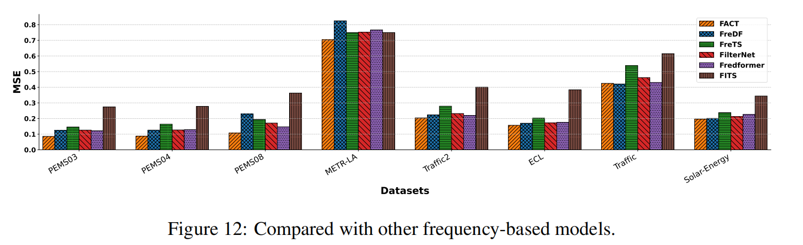
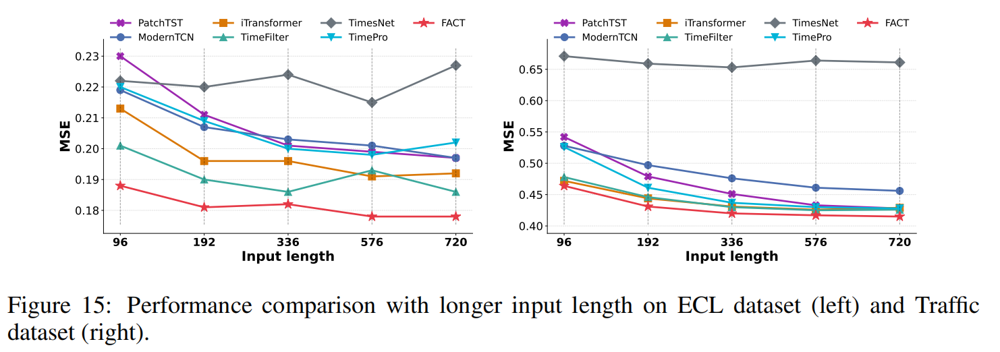

# FACT

Official implementation of the paper **"FACT: Fine-grained Across-variable Convolution for Multivariate Time-series Forecasting" (ICLR 2026)**.

FACT is an efficient convolution-based architecture for multivariate time series forecasting. It explicitly models **fine-grained across-variable dependencies** in both the **time domain** and the **frequency domain**, enabling strong forecasting performance while maintaining high computational efficiency.

## Overview

Modeling variable relationships is a central challenge in multivariate time series forecasting, especially for high-dimensional data. While many existing methods focus on coarse-grained correlations among variables, real-world dependencies are often **dynamic**, **local**, and **granularity-dependent**.

FACT addresses this challenge by introducing a fine-grained across-variable convolution framework with three key ideas:

- **Dual-domain modeling** to capture complementary dependencies in the **time** and **frequency** domains
- **DConvBlock**, a depth-wise convolution module with channel-specific kernels for efficient fine-grained interaction modeling
- **2D variable reconfiguration** and **multi-dilated convolution** to enlarge the receptive field while reducing model depth and computation

Extensive experiments show that FACT achieves strong forecasting accuracy on multiple benchmark datasets and offers clear efficiency advantages over attention-based approaches.

## Highlights

- Fine-grained modeling of **dynamic across-variable interactions**
- Joint learning in both the **time domain** and **frequency domain**
- Efficient **depth-wise channel-specific convolution** design
- **2D reconfiguration** for better receptive field coverage
- **Multi-dilated convolutions** for scalable interaction modeling
- Strong empirical results on diverse benchmark datasets
- Improved training efficiency and lower memory consumption compared with attention-based models

## Architecture

The overall architecture of FACT is shown below:

<p align="center">
  
</p>

FACT first projects the input multivariate time series into a hidden embedding space. It then models variable interactions through two complementary branches:

1. **Time-domain branch**
   - captures instantaneous and time-varying dependencies among variables

2. **Frequency-domain branch**
   - captures frequency-specific interactions through amplitude and phase modeling

At the core of the framework is **DConvBlock**, which uses depth-wise convolutions, 2D reshaping, and multi-dilated kernels to efficiently model both local and long-range variable dependencies.

## Repository Structure

```text
FACT/
├── data_provider/        # Dataset loading and preprocessing
├── exp/                  # Experiment pipeline
├── layers/               # Core neural network layers
├── models/               # Model definitions
├── utils/                # Utility functions
├── dataset/              # Benchmark datasets
├── figure/               # Figures used in README
├── FACT.sh               # Script for reproducing experiments
├── requirements.txt      # Python dependencies
└── README.md
```

## Installation

1. Create a Python environment with **Python 3.8**.

2. Install dependencies:

```bash
pip install -r requirements.txt
```

## Data Preparation

All benchmark datasets can be downloaded from [Google Drive](https://drive.google.com/file/d/1MKugRwUKN2u9tIBgES-n3-QOT5l6unLl/view?usp=drive_link).

After downloading, place the datasets under the `./dataset` directory. For example:

```text
./dataset/electricity/electricity.csv
```

Please ensure that the dataset directory structure matches the expected paths used in the code.

## Quick Start

To reproduce the main experimental results reported in the paper, run:

```bash
sh FACT.sh
```

This script reproduces the benchmark experiments for FACT across multiple datasets and forecasting settings.

## Experimental Results

### Overall performance on different datasets
We evaluate the proposed FACT on twelve datasets, encompassing diverse variable relationships. For long-term forecasting (prediction lengths: {96, 192, 336, 720}), we use three high-variable real-world datasets: ECL, Traffic, and Solar-Energy. For short-term forecasting (prediction lengths: {12, 24, 48, 96}), we include nine public datasets: PEMS03, PEMS04, PEMS07, PEMS08, PEMSD7, PEMS-BAY, METR-LA, electricity and Traffic2. The lookback length of all datasets are fixed to 96 for fair comparison.
<p align="center">
  
</p>

### Overall performance on the target forecasting horizon
Although averaging errors across all forecasting horizons is the standard evaluation protocol in multivariate time series forecasting, as adopted by recent representative works such as PatchTST, iTransformer, and TimeFilter, evaluation at specific target horizon H (single time step) is also important. Therefore, we report performance with several different target horizons (target time step t+H): t+3, t+6, t+12, and t+24. For a comprehensive comparison, we include several recent and competitive baselines: the latest attention-based models (iTransformer, TimeXer), the latest graph-based model (TimeFilter), and the latest Mamba-based model (TimePro).

<p align="center">
  
</p>


### Comparison with attention-based models
Since our DConvBlock adopts a Transformer-like architecture, its key distinction lies in replacing the attention mechanism with multi-dilated depth-wise convolutions to capture fine-grained variable interactions. To evaluate the efficacy and efficiency of this design, we conduct a detailed comparison between multi-dilated depth-wise convolutions and attention mechanisms in terms of forecasting accuracy, training time, and memory cost. FACT achieves strong forecasting accuracy while also providing substantial efficiency gains over attention-based architectures, especially in training cost and memory usage.
<p align="center">
  
</p>

### Comparison with attention-based models
To further evaluate the effectiveness of our proposed frequency modeling design, we conduct a comprehensive comparison with several representative frequency-based models, including FreDF, FreTS, FilterNet, FITS, and Fredformer, all of which are well-known for capturing frequency-domain patterns in time series data. FACT consistently outperforms these models across all datasets. This consistent superiority not only demonstrates the effectiveness of our frequency modeling approach but also underscores the advantage of explicitly capturing fine-grained cross-variable interactions from the frequency-domain perspective.
<p align="center">
  
</p>

### Longer input length
Longer input lengths provide models with more historical information, which, when effectively leveraged, can significantly improve forecasting accuracy. To comprehensively evaluate the ability of FACT to utilize extended historical context, we conduct experiments varying the input sequence lengths over the set {96, 192, 336, 576, 720}. Our results demonstrate that FACT consistently achieves state-of-the-art accuracy across all input lengths on both datasets. This stability and robustness indicate that FACT effectively leverages extended historical information to improve prediction quality, outperforming other models regardless of the amount of past data available.
<p align="center">
  
</p>


## Reproducibility

To ensure successful reproduction of the reported results, please make sure that:

- the required Python environment is correctly configured,
- all datasets are placed under the correct directory,
- dependency versions match those in `requirements.txt`,
- the experiment configuration is consistent with the provided scripts.

For the fairest comparison, we recommend using the provided `FACT.sh` script directly.

## Citation

If you find this repository useful for your research, please cite:

```bibtex
@inproceedings{wang2026fact,
  title={FACT: Fine-grained Across-variable Convolution for Multivariate Time-series Forecasting},
  author={Huiqiang Wang and Jieming Shi and Qing Li},
  booktitle={International Conference on Learning Representations (ICLR)},
  year={2026}
}
```

## Acknowledgements

We thank the research community for prior work on multivariate time series forecasting.
- Informer (https://github.com/zhouhaoyi/Informer2020)
- TimesNet (https://github.com/thuml/TimesNet))
- iTransformer (https://github.com/thuml/iTransformer)

## Contact

If you have any questions about the paper or the code, please feel free to contact Huiqiang Wang (wanghq2117@gmail.com).
